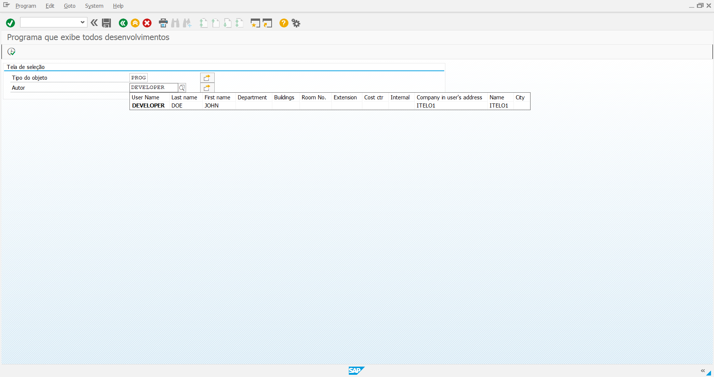
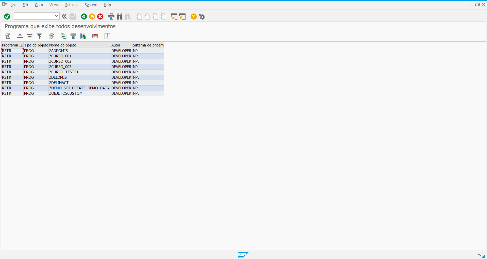

# 📦 Inventário de Objetos Customizados SAP (ABAP ALV)

Relatório executável em SAP ABAP para inventário, governança e auditoria de desenvolvimentos customizados (`Z*` e `Y*`) no repositório do SAP (`TADIR`).

---

## 🎯 Caso de Uso

Em uma demanda de fábrica de software, surgiu a necessidade de inventariar todos os desenvolvimentos criados em um ambiente de cliente. O processo inicial, realizado manualmente objeto por objeto, revelou-se improdutivo, estático e suscetível a erros.

Este projeto foi desenvolvido para substituir o processo manual por uma **ferramenta automatizada**, permitindo filtros dinâmicos e extração instantânea direto do dicionário de dados do SAP.

---

## 🚀 Funcionalidades

- **Filtros Dinâmicos (`SELECT-OPTIONS`):** Permite filtrar por tipo de objeto (`CLAS`, `PROG`, `FUGR`, `TABL`), autor ou rodar a consulta completa.
- **Otimização de Memória:** Consulta direta via Open SQL com operadores dinâmicos (`IN`), evitando duplicidade de tabelas internas e loops de atribuição campo a campo.
- **Tratamento de Exceções:** Validação de retorno vazio (`IS INITIAL`) com aviso amigável (`DISPLAY LIKE 'W'`) e encerramento seguro via `LEAVE LIST-PROCESSING`.
- **Layout Profissional:** Visualização em grade ALV com cores alternadas (zebrado) e dimensionamento automático de colunas (`slis_layout_alv`).

---

## 📸 Demonstração

### Tela de Seleção

### Grade ALV com Resultados

---

## 🛠️ Tecnologias e Conceitos Aplicados

- **Linguagem:** SAP ABAP
- **Tabela Repositório:** `TADIR`
- **Módulo de Função:** `REUSE_ALV_GRID_DISPLAY`
- **Técnicas:** Fieldcatalog dinâmico via rotinas parametrizadas (`FORM ... USING`), boas práticas de performance Open SQL e Clean ABAP.

---

## ⚙️ Como Executar

1. Acesse a transação `SE38` no SAP GUI.
2. Crie um programa executável com o nome `ZOBJETOSCUSTOM`.
3. Cole o código-fonte localizado em [`src/zobjetoscustom.abap`](src/zobjetoscustom.abap).
4. No menu: **Ir para > Elementos de texto > Textos de seleção**, ative a referência do dicionário para `S_AUTHOR` e `S_OBJECT`.
5. Em **Símbolos de texto**, cadastre o `001` com o texto `Critérios de Seleção`.
6. Ative (`Ctrl + F3`) e execute (`F8`).

---

## 👤 Autor

Desenvolvido por **Victor Emanuel**  
- [Perfil no LinkedIn](https://www.linkedin.com/in/victor-emanuel-pires/)
